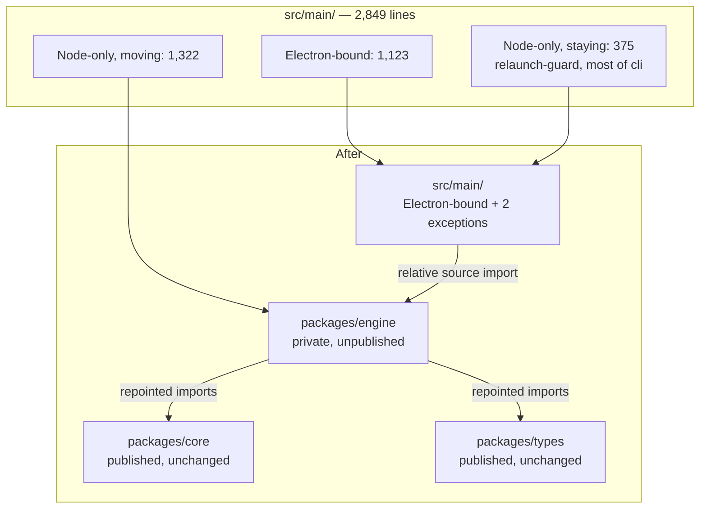
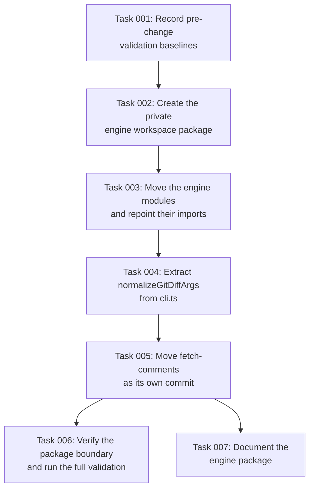

# Plan: Shared engine workspace package

## Original Work Order

Work order as supplied

> This is the third of four pull requests decomposing a rejected 5,392-line
> change that added an HTTP serve mode to the application. The review it received
> was:
>
> > I feel like this change is too big for what it is.
>
> The decomposition is: a bug fix in a published component; extraction of the
> review handler bodies behind an explicit session object; **this change, the
> move**; and finally serve mode itself as a Node command-line program. The first
> two have merged. The maintainer has agreed to serve mode and to its shipping as
> an `npx`-invoked Node command rather than a subcommand of the desktop binary, so
> the destination is settled; the sequence remains small because small changes are
> easier to review, not because the direction is in doubt.
>
> The preceding change established that the review handlers are transport
> agnostic but left them inside the desktop application's main-process directory.
> This change moves that layer into a new workspace package so it can be consumed
> by something that is not the desktop application.
>
> Move the Node-only modules out of `src/main/`: the review handlers and startup
> mode from the preceding change, together with guide loading, diff loading,
> staged and untracked handling, remote-mode handling, and the argument-parsing
> portion of the command line module. Move the `fetch-comments` orchestrator as
> well, **as its own commit**, because it is a separable piece with its own
> rationale and a reviewer should be able to consider it on its own.
>
> The package is **private** at this stage. It must not be added to
> `.releaserc.json` and must not be added to the publish loop in
> `.github/workflows/release.yml`. Publishing commits to a public API surface, and
> that commitment belongs with the change that first needs the package resolvable
> from a registry.
>
> This is a pure move. Nothing user-visible changes, and reviewed with rename
> detection the diff should read as close to empty. Nine modules in `src/main/`
> are already two-line re-export shims over `packages/core`, which is the existing
> precedent for how the desktop application continues to reach a moved module if
> any indirection is retained.
>
> Constraints: no changes to `packages/core`, `packages/types` or `packages/react`.
> Do not modify the Electron fuse configuration in `forge.config.ts`. The desktop
> application must keep working and the default branch must remain releasable. The
> repository squash-merges and derives release versions from pull request titles
> via semantic-release's angular preset. The plan directory ships with the change,
> as the repository does for its other plans.
>
> Out of scope: anything to do with HTTP or serve mode, publishing this package,
> giving any moved module a command-line entry point of its own, and resolving
> issue #143.

## Plan Clarifications

| Question | Answer |
| --- | --- |
| What is the package called? | `@self-review/engine`, at `packages/engine`. "Session" was the working name and was rejected: as an npm name it reads as HTTP or authentication session handling to anyone who has not read the repository. The `ReviewSession` type keeps its name, which is unambiguous in a function signature. |
| Should the package be published to npm as part of this change? | No. It is created private, absent from the release configuration and the publish loop. The change that first needs it resolvable from a registry is the one that publishes it. |
| Does moving `fetch-comments` resolve issue #143? | No, and the plan must not claim it does. #143 is a crash during Electron's platform initialisation. Moving the module while the desktop binary still imports and routes it leaves that initialisation exactly where it was. The move is a prerequisite for the structural fix, which needs a non-Electron entry point and therefore belongs to the change that publishes the package. |
| Is backwards compatibility required? | Yes for the desktop application's observable behaviour, which must not change. There is no external API surface, because the package is private and the three published packages are untouched. |
| Does the desktop application import the new package directly, or through retained shims? | Directly, by deep relative source path (`../../packages/engine/src/...`). This is what all ten existing shims and `fetch-comments.ts` already do to reach `packages/core`, it needs no change to `webpack.rules.ts` or `tsconfig.json`, and it introduces no build step. Importing by package name would resolve through the workspace symlink and depends on webpack resolving symlinks to their real path before applying ts-loader's `node_modules` exclusion — a subtlety that surfaces in the packaged build rather than in development. |
| How is `cli.ts` split? | Only `normalizeGitDiffArgs` moves. `parseCliArgs` and `checkEarlyExit` both call `getAppArgs`, which reads `process.defaultApp` for Electron's dev-mode argv shape and filters macOS Finder `-psn_` arguments. Moving them would mean changing their signatures to accept an argv array, which is a content change rather than a move. `normalizeGitDiffArgs(args, cwd)` is already pure and moves verbatim. |
| Where do the unit tests for the moved modules go? | With their modules. Seven of the ten `src/main/*.test.ts` files cover move-set modules. `packages/engine` gets its own vitest configuration and `test:unit` script, mirroring `packages/core`, and the root `test:unit` script gains `--workspace @self-review/engine`. Without that last step the tests would stop running in CI while Success Criterion 7 still reported green. |
| Why does this plan describe `packages/engine` when the change landed in `packages/core`? | The plan was executed as written and did create `packages/engine`. Reviewing the result afterwards raised a question the plan never asked: whether a fourth package earns its keep. The three existing packages have never once diverged in version, `core` was already entirely Node-bound and using the same builtins, and it is in practice internal to this repository. The premise — *a new workspace package* — came from the work order and was never argued. It did not survive being argued, so the layer was folded into `packages/core` before the change was opened for review. The plan text below is left exactly as written and executed; this row records that the shipped outcome differs from it. |
| What happens to the shims the move strands? | `src/main/diff-parser.ts` and `src/main/git.ts` are deleted. `git-diff-loader.ts` is their only remaining consumer and it moves, leaving them with none. The deletions are named in Success Criterion 11 so a reviewer expects them rather than discovering them. `synthetic-diff.ts` already has no consumer on the default branch; it is pre-existing and is left alone. |

## Executive Summary

The preceding change proved the review handlers do not depend on the desktop
runtime, but left them living inside it. This change relocates that layer into a
workspace package of its own, which is the step that makes a second front end
possible at all.

It is deliberately a move and nothing else. No behaviour changes, no interface is
redesigned, and no package is published. Reviewed with rename detection it should
be close to an empty diff, which is the point: a reviewer should be able to
satisfy themselves that nothing happened other than files changing location and
imports being updated to match.

Three things accompany the move and are called out so they are not mistaken for
scope creep. Five import edges are repointed at `packages/core` and
`packages/types`, without which the new package would import out of `src/`
(Component 3). Two shims the move strands are deleted rather than left dead. And
the root `test:unit` script gains the engine workspace, without which the
relocated tests would stop running while every suite still reported success
(Component 5).

The package is created private. An unpublished package carries no compatibility
obligation and no public API surface, so this change asks a reviewer to accept a
reorganisation rather than a commitment. The decision to publish belongs with the
change that first requires it.

## Context

### Current State vs Target State

Measured on the default branch at `bc9c133`, after the handler extraction merged.
`src/main/` holds 2,849 lines excluding tests.

| Current State | Target State | Why? |
| --- | --- | --- |
| The Node-only engine layer lives in the desktop application's main-process directory | It lives in its own workspace package | Code that does not depend on the desktop runtime should not be reachable only through it |
| Anything wanting the engine layer must depend on the desktop application | The engine layer is an ordinary workspace dependency | A second front end cannot depend on an Electron application, and duplicating the layer is what the preceding extraction exists to prevent |
| Of 2,849 main-process lines, only 1,123 import Electron | The directory holds substantially only Electron-bound code | The directory should describe what it contains, so the desktop-specific surface is visible rather than inferred |
| Three published packages exist, and no engine package | An engine package exists and is private | Its existence is needed now; its public API is not, and publishing is difficult to reverse |

### Background

Part of a four-way decomposition. A change adding an HTTP serve mode was rejected
for its size, and the size followed from the shape of the code: reaching the
engine logic meant reaching into a desktop application.

The split is measurable rather than a matter of taste. Classifying every
non-test module in `src/main/` by whether it imports `electron`:

| Group | Lines | Modules |
| --- | --- | --- |
| Imports Electron | 1,123 | `main.ts`, `ipc-handlers.ts`, `version-checker.ts`, `menu.ts`, `app-assets.ts` |
| Imports no Electron | 1,697 | `review-handlers.ts`, `remote-mode.ts`, `fetch-comments.ts`, `cli.ts`, `relaunch-guard.ts`, `guide-loader.ts`, `startup-mode.ts`, `git-diff-loader.ts`, `staged-untracked.ts` |
| Re-export shims over `packages/core` | 29 | nine two-line modules, plus `git.ts` |

The second group is what this change relocates, minus the exceptions recorded
below. Those exceptions are substantial: `relaunch-guard.ts` stays whole and
`cli.ts` gives up only one function, so the move set is 1,322 lines rather than
1,697 — `review-handlers.ts` 421, `remote-mode.ts` 321, `fetch-comments.ts` 304,
`guide-loader.ts` 115, `startup-mode.ts` 76, `git-diff-loader.ts` 42,
`staged-untracked.ts` 28, and roughly 15 lines of `normalizeGitDiffArgs`.

The third group is the existing precedent for this pattern in two senses: the
repository already reaches moved modules this way, and it does so by deep
relative source path rather than by package name, which is the mechanism this
change adopts. So this change extends a convention rather than introducing one.

## Architectural Approach

### Component 1 — Establish the package

**Objective**: Create a workspace package that is deliberately not publishable.

`packages/engine` is added and declared private: `"private": true`, version
`0.0.0`, no `publishConfig`, and no `exports` block, because nothing resolves it
by package name. It is absent from `.releaserc.json` and from the `for pkg in
packages/types packages/core packages/react` loop in the release workflow, so no
release automation touches it and its version never moves with the others.

Test configuration follows `packages/core`: a vitest config and a `test:unit`
script, so the package's tests run standalone from its own directory. The root
`test:unit` script is extended to invoke that workspace.

Its dependency direction is one way: it may depend on the existing published
primitives, and nothing in it may depend on the desktop application. Component 3
is what makes that true rather than aspirational, because several move-set
modules currently import modules that stay behind.

### Component 2 — Move the engine layer

**Objective**: Relocate the Node-only modules without changing them.

The move set is the second group above, with three exceptions decided on
evidence rather than by the mechanical "imports no Electron" test:

| Module | Decision | Reasoning |
| --- | --- | --- |
| `relaunch-guard.ts` | Stays | It re-execs the application from its real bundle path when launched through a symlink. A Node program has no bundle. It passes the mechanical test but is desktop-specific in substance. |
| `cli.ts` | Splits, narrowly | Only `normalizeGitDiffArgs` moves. `parseCliArgs` and `checkEarlyExit` both route through `getAppArgs`, which reads `process.defaultApp` and filters macOS Finder `-psn_` arguments; they are shaped by Electron's argv even though the file imports nothing from it. Moving them would change their signatures, which is not a move. |
| `remote-mode.ts` | Moves | It imports only `git-diff-loader` and `packages/core`, and is what a second front end needs to open a pull request URL and load its threads. |
| `fetch-comments.ts` | Moves, separately | See Component 4. |

Files move and imports are updated to match. Nothing is rewritten, reformatted or
improved in transit; an improvement noticed along the way is noted for later
rather than folded in, because it would defeat the reviewability this change
exists to provide.

The desktop application reaches the moved modules directly, by deep relative
source path: `../../packages/engine/src/...`. No re-export shims are retained for
them. This is the mechanism the existing shims already use to reach
`packages/core`, so it needs no webpack alias, no `tsconfig` path entry and no
build step.

### Component 3 — Repoint the imports that cross the new boundary

**Objective**: Make the one-way dependency direction true rather than asserted.

Several move-set modules import modules that stay behind, so relocating them
unchanged would leave `packages/engine` importing out of `src/`. Five edges have
to be repointed, and they are the only reason a relocated file's contents differ
at all:

| In | Currently imports | Becomes |
| --- | --- | --- |
| `git-diff-loader.ts` | `./git` | `../../core/src/git` |
| `git-diff-loader.ts` | `./diff-parser` | `../../core/src/diff-parser` |
| `review-handlers.ts` | `./directory-scanner` | `../../core/src/directory-scanner` |
| `review-handlers.ts` | `./payload-sizing` | `../../core/src/payload-sizing` |
| five modules | `../shared/types` | `../../types/src/index` |

The first four targets are two-line re-export shims over `packages/core`, so
repointing them at `packages/core` changes which file is named and nothing about
what is imported. The fifth is the same shape: `src/shared/types.ts` re-exports
`packages/types/src/index`.

Two of those shims lose their last consumer once `git-diff-loader.ts` moves.
`src/main/diff-parser.ts` and `src/main/git.ts` are deleted rather than left
behind as dead re-exports. The deletions are deliberate and named, not a
side-effect of the move. `synthetic-diff.ts` is already unreferenced on the
default branch; it predates this change and is left alone.

### Component 4 — Move `fetch-comments`, as its own commit

**Objective**: Relocate the headless orchestrator separately, so it can be
reviewed on its own terms.

`fetch-comments.ts` imports only from `packages/core` and `src/shared/types`.
Nothing from `src/main/`, nothing from `electron`. Its entire connection to the
desktop application is the import at `src/main/main.ts:9` and the subcommand
routing at `src/main/main.ts:602`. It is already a Node program; only its
location says otherwise.

It travels as its own commit because it is separable in a way the rest of the
move is not. The rest of the move exists to make a second front end possible.
This module is not consumed by any front end: the serve program will never call
it, since the two are parallel orchestrators over the same primitives rather than
caller and callee. It moves because it belongs with the Node code, and a reviewer
should be able to accept or reject that argument without it being entangled with
the others.

**What this does not do.** It does not resolve issue #143. The desktop binary
continues to import and route it, so Electron still initialises its platform, and
that initialisation is the crash. The move makes the structural fix reachable by
putting the code where a command-line entry point could later be attached; it
does not attach one, because the package is private here and a private package's
entry point is not installable. Any claim that this change fixes #143 would be
wrong.

### Component 5 — Relocate the tests with their modules

**Objective**: Keep every relocated module's tests running, in CI, without
relying on anyone noticing that they stopped.

Seven of the ten `src/main/*.test.ts` files cover move-set modules: `cli`,
`fetch-comments`, `guide-loader`, `remote-mode`, `review-handlers`,
`staged-untracked` and `startup-mode`. They move with the code they cover.
`cli.test.ts` splits the way `cli.ts` does — its `normalizeGitDiffArgs` block
travels, the rest stays.

This has a failure mode worth naming. `vitest.config.main.ts` includes only
`src/main/**/*.test.ts`, and the root `test:unit` script runs the main config,
the renderer config, and `--workspace @self-review/core`. Tests moved out of
`src/main/` without a matching workspace invocation stop running everywhere,
including CI, and every suite still reports success. So the root script gains
`--workspace @self-review/engine` in the same change that moves the first test
file, and Success Criterion 10 checks the executed-file count rather than the
exit status.

### Component 6 — Confirm the boundary holds

**Objective**: Make the separation checkable rather than asserted.

Three properties are verified directly, and all three are mechanical checks
against the source rather than judgements.

Nothing in the new package imports the desktop runtime, transitively included,
and nothing in it resolves into `src/` at all. The main-process directory retains
only modules that either import that runtime, are deliberate re-exports still
having a consumer, or are one of the recorded exceptions. And the test files that
moved are actually being executed, measured by count rather than by exit status,
because a suite that runs nothing passes.

## Risk Considerations and Mitigation Strategies

Technical Risks

- **A module resolves somewhere unexpected after the move.** Deep relative
  imports and retained re-export shims can mask a module quietly resolving to a
  different file, and type checking may still pass.
    - **Mitigation**: Run a clean dependency install from an empty state before
      believing any result, and confirm the desktop application builds and starts
      from it. A stale `node_modules` will hide exactly this class of error.
- **A silent behaviour change during the move.** Import rewriting across many
  files invites incidental edits.
    - **Mitigation**: Review the diff with rename detection and require every
      relocated file to show no content change beyond import paths. Anything else
      must be deliberate and named.
- **The packaged application diverges from the development build.** Webpack
  resolves a workspace package by name differently from a relative path, and the
  packaged binary is where that surfaces. `webpack.rules.ts` excludes
  `node_modules` from ts-loader, so a by-name import is processed only because
  webpack resolves the workspace symlink to its real path first.
    - **Mitigation**: Sidestepped rather than managed. The desktop application
      imports by deep relative source path, which is the mechanism already in use
      and leaves `webpack.rules.ts` and `tsconfig.json` untouched. The
      packaged-application integration suite is still run before and after and
      compared scenario by scenario, as the preceding change did.
- **Relocated tests stop running and every suite still passes.** The root
  `test:unit` script enumerates workspaces explicitly, so a test file moved out of
  `src/main/` is simply never invoked. Nothing fails; the coverage just leaves.
    - **Mitigation**: Component 5 adds the workspace invocation in the same change
      that moves the first test file, and Success Criterion 10 compares the count
      of executed test files against the default branch rather than reading the
      exit status.
- **Four moved modules have no Electron end-to-end coverage.** The six Electron
  feature files cover error handling, resume, XML output, expand context,
  find-in-page and the welcome screen. Guided mode, `--staged`, remote PR/MR mode
  and `fetch-comments` are not among them. Their unit tests move into the package
  and keep passing there, which proves the module works and not that the desktop
  application still reaches it.
    - **Mitigation**: Self Validation steps 12 to 14 exercise those three launch
      paths against the packaged application by hand; step 11 already covers
      `fetch-comments`.
- **The move set is drawn by the mechanical test alone.** Three modules pass
  "imports no Electron" while being desktop-specific, split, or separable.
    - **Mitigation**: The exceptions are recorded in Component 2 with reasoning,
      and Success Criterion 3 requires the decisions to be stated rather than
      implied by what happened to move.

Implementation Risks

- **Scope creep into the change that follows.** Publishing the package, adding an
  entry point, or anything HTTP would reintroduce the size problem this
  decomposition exists to solve.
    - **Mitigation**: Enumerated in the success criteria: private, no entry point,
      no HTTP, no release configuration.
- **The `fetch-comments` commit is presented as a bug fix.** It is adjacent to a
  filed issue and the temptation to claim it is real.
    - **Mitigation**: Component 4 states what it does not do, and Success
      Criterion 8 requires the pull request to say so as well.

## Success Criteria

### Primary Success Criteria

1. `packages/engine` exists, is declared private, and appears in neither the
   release configuration nor the publish loop.
2. Nothing in the package imports the desktop runtime, directly or transitively.
3. The main-process directory retains only modules that import the desktop
   runtime, or are deliberate re-exports that still have a consumer, except the
   recorded exceptions, and each exception is stated with its reasoning.
4. `fetch-comments` moves in a commit of its own, separable from the rest of the
   move.
5. The change is a move: reviewed with rename detection, no relocated file shows
   content changes beyond import paths, except where a change is deliberate and
   identified.
6. The desktop application's observable behaviour is unchanged, and it builds and
   starts from a clean dependency install.
7. Unit and browser end-to-end suites pass, and the packaged-application
   integration suite produces the same result as on the unmodified default branch.
8. The three published packages are untouched, no moved module gains a
   command-line entry point, and the pull request states explicitly that it does
   not resolve issue #143.
9. Nothing under `packages/engine` resolves into `src/`. Every import that
   crossed the new boundary points at `packages/core` or `packages/types`.
10. The relocated unit tests execute in CI. `npm run test:unit` invokes the engine
    workspace, and the number of test files it executes matches the default
    branch.
11. `src/main/diff-parser.ts` and `src/main/git.ts` are deleted, and nothing
    imports them.

## Self Validation

1. On the unmodified default branch, run the packaged-application integration
   suite against a fixed repository fixture and record the result as the
   comparison baseline. This must happen before any file is modified.
2. Apply the change, remove all installed dependencies and build output, run a
   clean install, and confirm the desktop application builds and launches against
   a real repository showing a diff.
3. Run the unit suites and the browser end-to-end project and confirm both pass.
4. Re-run the packaged-application integration suite against the same fixture and
   compare scenario by scenario against the baseline.
5. Search the new package, including transitive imports, for any reference to the
   desktop runtime and confirm there are none.
6. List the modules remaining in the main-process directory and confirm each
   either imports the desktop runtime, is a deliberate re-export, or is a recorded
   exception, and that no module is left behind that the move set should have
   taken.
7. Produce the diff with rename detection enabled and confirm relocated files show
   no content change other than import paths.
8. Confirm `git log` shows the `fetch-comments` move as its own commit, and that
   reverting that commit alone leaves the rest of the move intact and the suites
   passing.
9. Confirm the package declares itself private, and search the release
   configuration and the publish workflow for its name, expecting no match.
10. Run the package's own test script from within its directory and confirm it
    succeeds standalone. There is deliberately no build script: nothing resolves
    the package by name, so it has no entry point to build.
11. Confirm `self-review fetch-comments` still works from the packaged binary
    exactly as before, including that it still fails on Linux with no display,
    since this change does not fix that.
12. Launch the packaged application against a repository holding a
    `review.guide.xml` sidecar and confirm guided mode renders its groups,
    per-file descriptions and overview. The Electron end-to-end suite does not
    cover this path, so nothing else will catch a broken `guide-loader` import.
13. Launch the packaged application with `--staged` against a repository with
    staged changes and confirm the diff loads. Likewise uncovered by the Electron
    suite.
14. Launch the packaged application with a forge pull request URL and confirm the
    remote session opens and its threads load. Likewise uncovered.
15. Confirm `src/main/diff-parser.ts` and `src/main/git.ts` no longer exist, and
    that searching the repository for imports of them returns nothing.
16. Record the number of test files executed by `npm run test:unit` on the
    unmodified default branch, and confirm the number after the change is
    identical. A lower number means relocated tests are no longer being invoked.

## Documentation

- `AGENTS.md`: yes, an update is required. Record that the Node-only engine layer
  now lives in `packages/engine` rather than the desktop main-process directory,
  and that the directory holds Electron-bound code. The source tree listing needs
  the moved modules removed and the package added.
- `AGENTS.md`: the two deleted shims must come out of any listing that names
  them, and the note that the Electron app imports workspace packages by relative
  source path should be extended to cover `packages/engine`.
- A README for `packages/engine` stating what it is for and that it is currently
  private and unpublished.
- Root `package.json`: the `test:unit` script gains
  `--workspace @self-review/engine`. Not documentation as such, but it is the step
  whose omission is silent, so it is recorded here as well as in Component 5.
- No user-facing documentation changes, because nothing observable changes.

## Resource Requirements

### Development Skills

- npm workspaces, including package configuration and dependency direction.
- TypeScript project configuration across package boundaries.
- Git, at the level of producing and reading rename-detected diffs and keeping a
  separable commit separable.
- Playwright and Vitest, for running the existing suites as a comparison.

### Technical Infrastructure

- The existing workspace toolchain: TypeScript, Webpack, Electron Forge, Vitest
  and Playwright.
- A machine able to run the packaged desktop application, including a display or
  virtual framebuffer, for the comparison runs.
- A git repository fixture held constant across the before and after runs.

## Integration Strategy

The handler extraction this depends on has merged, so this change starts from the
default branch directly rather than being stacked.

The change that follows builds an externally invoked program on this package,
publishes it, and is where `fetch-comments` can finally gain a non-Electron entry
point and issue #143 can be resolved structurally. That change depends on this
one and is rebased onto the default branch after it merges, because the
repository squashes on merge.

## Notes

- Nothing from the earlier `feat/serve-mode` branch is carried across as a commit.
- The package is private on purpose. Publishing belongs to the change that first
  needs it resolvable from a registry.
- `@self-review/engine` was named `session` in an earlier draft. The rename is
  deliberate: as a published name, "session" reads as HTTP or authentication
  session handling. The `ReviewSession` type is unaffected.
- Issue #143 is referenced in this plan only to be explicitly excluded. The narrow
  fix for it, appending an Ozone platform switch when a headless subcommand is
  detected, is independent of this change and can land in either order.
- Plan 62 still refers to this package as `packages/session`, the name this plan
  rejected. It needs updating before it is decomposed. Out of scope here.

### Change Log

- 2026-09-04: Narrowed the `cli.ts` split to `normalizeGitDiffArgs` alone, after
  finding that `parseCliArgs` and `checkEarlyExit` both route through
  `getAppArgs` and are shaped by Electron's argv. Moving them would have changed
  their signatures, contradicting Success Criterion 5.
- 2026-09-04: Added Component 3. Five import edges cross the new boundary —
  `./git`, `./diff-parser`, `./directory-scanner`, `./payload-sizing` and
  `../shared/types` — and left unrepointed they would have had the new package
  importing out of `src/`, inverting the dependency direction Component 1 asserts.
- 2026-09-04: Added Component 5. The plan had not mentioned tests at all, and
  seven of ten `src/main` test files cover move-set modules. Recorded the silent
  failure mode where moved tests stop being invoked while every suite still
  passes, and added Success Criterion 10 against it.
- 2026-09-04: Settled the import mechanism as deep relative source paths, which
  keeps `webpack.rules.ts` and `tsconfig.json` untouched and introduces no build
  step. Demoted the corresponding technical risk from open question to sidestepped.
- 2026-09-04: Decided to delete `src/main/diff-parser.ts` and `src/main/git.ts`,
  which the move strands, rather than leave them as dead re-exports.
- 2026-09-04: Added Self Validation steps 12 to 16 after confirming the Electron
  end-to-end suite covers none of guided mode, `--staged` or remote mode, so the
  desktop application's wiring to those moved modules has no automated check.
- 2026-09-04: Corrected the move-set size from an implied 1,697 lines to 1,322,
  reflecting that `relaunch-guard.ts` stays whole and `cli.ts` gives up one
  function.

## Execution Blueprint

**Validation Gates:**
- Reference: `/config/hooks/POST_PHASE.md`

### Dependency Diagram

The graph is a chain with one terminal fork, and it is acyclic. The chain is not
incidental: tasks 3, 4 and 5 each edit `src/main/main.ts`, so running them
concurrently would collide, and task 5 is deliberately last so its commit stays
revertable on its own as Success Criterion 4 requires.

### ✅ Phase 1: Baseline
**Parallel Tasks:**
- ✔️ Task 001: Record pre-change validation baselines

Nothing may modify a tracked file until this phase completes — Self Validation
step 1 requires the packaged-integration baseline to be taken against the
unmodified default branch.

### ✅ Phase 2: Package scaffold
**Parallel Tasks:**
- ✔️ Task 002: Create the private engine workspace package (depends on: 001)

### ✅ Phase 3: The move
**Parallel Tasks:**
- ✔️ Task 003: Move the engine modules and repoint their imports (depends on: 002)

### ✅ Phase 4: The cli extraction
**Parallel Tasks:**
- ✔️ Task 004: Extract normalizeGitDiffArgs from cli.ts (depends on: 003)

### ✅ Phase 5: fetch-comments
**Parallel Tasks:**
- ✔️ Task 005: Move fetch-comments as its own commit (depends on: 004)

### ✅ Phase 6: Verification and documentation
**Parallel Tasks:**
- ✔️ Task 006: Verify the package boundary and run the full validation (depends on: 005)
- ✔️ Task 007: Document the engine package (depends on: 005)

### Post-phase Actions

After phase 3, run `npm run test:unit` and confirm the engine workspace reports
five test files rather than zero. A zero here means the root `test:unit` wiring
from task 2 did not take effect, and every later phase would report green while
running nothing.

After phase 5, confirm `git log --oneline` shows the `fetch-comments` move as a
single commit distinct from the rest of the move.

### Execution Summary
- Total Phases: 6
- Total Tasks: 7

## Execution Summary

**Status**: ✅ Completed Successfully
**Completed Date**: 2026-09-04

### Results

`packages/engine` exists as a private, unpublishable workspace package holding
eight modules moved out of the desktop main-process directory: `review-handlers`,
`remote-mode`, `guide-loader`, `startup-mode`, `git-diff-loader`,
`staged-untracked`, `fetch-comments` and `git-diff-args`, with their seven test
files. `src/main/diff-parser.ts` and `src/main/git.ts` were deleted, their last
consumers having moved.

Seven tasks across six phases, on `feature/61--shared-engine-workspace-package`,
eight commits from base `bc9c133`:

| Commit | Phase |
| --- | --- |
| `803ae59` | plan, tasks, blueprint and recorded baselines |
| `d8ed7e3` | the private engine package |
| `89e6417` | the move of six modules and five tests |
| `e2ba765` | the `normalizeGitDiffArgs` extraction |
| `82d72aa` | `fetch-comments`, in isolation |
| `eee512a` | blueprint progress |
| `5421a47` | documentation and stale path headers |
| `daa4ce0` | blueprint completion |

Every success criterion holds. The package imports no Electron in its transitive
closure and resolves nothing into `src/`; it is private at version `0.0.0` and
absent from both `.releaserc.json` and the publish loop; the relocated files show
no content change beyond import lines and the identified header-comment fixes;
and the 38 Electron end-to-end scenarios match the baseline one for one, in
order.

The load-bearing measurement was the test count. The baseline recorded 730 tests
across 53 files before anything moved; the final state is 730 tests across 54.
The count is identical and the single extra file is fully attributed to the
deliberate `cli.test.ts` split. `git ls-files` finds exactly 54 test files, so no
test file exists that no configuration invokes.

### Noteworthy Events

**Code review gate: skipped.** `reason`: `no-reviewer-candidate`. `detail`: "No
harness other than `claude` is installed and responsive, so the review gate was
skipped." No reviewer ran, so no findings were produced, acted on or ignored.
This change therefore carries no second-model review; a human reviewer is the
only review it has had.

**The task file's consumer analysis was wrong, and the verification grep was
shaped to miss it.** Task 3 stated that the two deleted shims had "exactly two
consumers". `src/main/ipc-handlers.test.ts` was a third, reaching them through
`vi.mock('./git')` and `await import('./git')`, and `review-handlers.ts` held
three further dynamic imports. The prescribed check, `grep "from './git'"`,
matches none of those forms and would have reported clean while the mocks
silently stopped intercepting. Found during execution and repointed. The lesson
is about the grep, not the file: a module-specifier check that only matches
static `from` clauses is not a check.

**A phase commit was made from a stale index.** `git mv` had already staged the
bare renames; a subsequent `git add` failed silently on a pathspec naming a file
that no longer existed, so the first `fetch-comments` commit contained the
renames without the import repointing — leaving `main.ts` importing a deleted
file. The pre-commit hook did not catch it because it tests the working tree,
not the staged snapshot. Amended to `82d72aa` and then verified by reverting it
in isolation, which landed cleanly on the phase 4 state with 730 tests green.

**Phase 6 was serialised rather than run in parallel.** The blueprint pairs
verification with documentation, but documentation edits the path headers of the
moved files, and verification asserts those files changed only in import lines.
Verifying first would have checked a tree that was about to change, so task 7
ran to completion before task 6 began.

**Three deliberate scope refusals.** `passWithNoTests: true`, added while the
package was empty, was removed once real tests arrived, so a vanished suite
cannot report success. A header-comment fix applied to `fetch-comments.ts` alone
was reverted so that every move commit stayed mechanically pure, and all seven
headers were then fixed together in the documentation commit. `synthetic-diff.ts`
remains an unreferenced shim: it predates this change and was left alone.

### Necessary follow-ups

1. **Plan 62 has an unresolved contradiction with this plan.** Its Notes call the
   `fetch-comments` display failure out of scope, while this plan's Integration
   Strategy names that change as where issue #143 is resolved structurally. One
   of the two has to give. Flagged in plan 62, not decided.
2. **`packages/engine` has no `tsconfig.json`.** It is typechecked only through
   the root config's `packages/**/*` include. Sufficient while there is no build;
   plan 62 will need one when it publishes.
3. **Engine's transitive runtime dependencies are undeclared.** It reaches core by
   relative source path, so `fast-xml-parser`, `xmllint-wasm`, `yaml` and
   `ignore` resolve through hoisted `node_modules`. Correct for a private in-repo
   package, and a publishing blocker for plan 62.
4. **The engine vitest config is looser than the config these tests used to run
   under.** `vitest.config.main.ts` set `mockReset`, `restoreMocks` and a 5s
   timeout; the package config sets none. Verified empirically that nothing
   depends on them today.
5. **`npm run test:coverage` does not cover the engine workspace**, the same
   pre-existing treatment `@self-review/core` already has.
6. **`src/main/synthetic-diff.ts` is dead**, and predates this change.

### Post-execution amendment

- 2026-09-04: `packages/engine` was folded into `packages/core` after execution
  and before review. Every module named in this plan exists at the stated
  filename under `packages/core/src/` rather than `packages/engine/src/`, is
  exported from core's `index.ts`, and its tests run in core's workspace. The
  test invariant this plan is built around is unaffected: 730 tests across 54
  files, unchanged from the recorded baseline. The Electron and webapp builds
  both alias `@self-review/core` to `src/browser.ts`, the Node-free subset, so
  exporting this orchestration from the package index cannot reach a browser
  bundle. Success Criteria 1 and 2, which speak to a private unpublished package
  and its boundary, no longer apply and were superseded by that decision.
