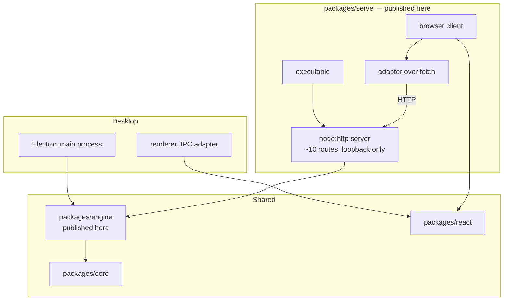

# Plan: Serve mode as a Node command-line package

## Original Work Order

Work order as supplied

> This is the fourth and last of four pull requests decomposing a rejected
> 5,392-line change that added an HTTP serve mode to the application. The review
> it received was:
>
> > I feel like this change is too big for what it is.
>
> The three preceding changes fixed a published component, extracted the review
> handler bodies behind an explicit session object, and moved the Node-only
> session layer into a private shared workspace package. This change builds the
> feature on top of them.
>
> The motivation: code under review often lives in an isolated environment that
> deliberately exposes no host filesystem mount and has no display, so a desktop
> window cannot reach it. Mounting the filesystem would defeat the isolation and
> pushing a branch defeats the point of reviewing before pushing. A served
> interface reached over an already-supported forwarded loopback port crosses that
> boundary with neither.
>
> Add a workspace package providing an executable, an HTTP server built on the
> Node standard library, and a browser client that mounts the existing React
> interface against an adapter implemented over the fetch API. Roughly ten routes,
> most of them thin wrappers over the shared session layer. No new runtime
> dependency. Make the session package public as part of this change and wire both
> new packages into `.releaserc.json` and the publish loop in
> `.github/workflows/release.yml`, because an externally invoked command must
> resolve its dependencies from the registry.
>
> **Because this program does not run inside the Electron binary it must not
> contain**: a re-exec of itself with a platform switch, a parent-process
> watchdog, an alternate asset-resolution branch for packaged builds, or detached
> spawning in its end-to-end fixture. The earlier attempt required all four
> because a headless subcommand inside the signed binary needs them; an ordinary
> Node process does not. Their reappearance means the program has been placed back
> inside the desktop binary.
>
> Settled scope decisions: the output path is fixed when the program starts and
> the interface offers no control for it, so the adapter omits the
> output-path-changing method entirely; completing a review writes the file and
> stops the server, so process lifetime is review lifetime and a closed tab does
> nothing; the review guide is resolved once at startup and returned with the
> diff, so the transport is request and response only with no server-initiated
> messages; and the listener binds to the loopback interface only, which is the
> entire access-control story.
>
> Constraints: no changes to `packages/core`, `packages/types` or `packages/react`.
> Do not modify the Electron fuse configuration in `forge.config.ts`. Do not
> include `.ai/strikethroo/**` in the pull request. The desktop application must
> keep working and the default branch must remain releasable. The repository
> squash-merges and derives release versions from pull request titles via
> semantic-release's angular preset.
>
> Out of scope: a welcome screen and therefore any remote entry point;
> authentication; binding to a non-loopback address; migrating existing
> integration scenarios onto this transport; and fixing the pre-existing headless
> failure in the `fetch-comments` subcommand.
>
> **For the maintainer to decide**: this shape means the serve capability is an
> externally invoked command rather than a subcommand of the desktop binary. If a
> single binary with a single command-line surface is preferred instead, this plan
> must be reworked, because running inside the binary reintroduces the re-exec and
> the watchdog. The three preceding changes are unaffected either way.

## Plan Clarifications

| Question | Answer |
| --- | --- |
| Should the shared engine package be published as part of this change? | Yes. It was created private deliberately, and this is the change that first needs it resolvable from a registry, so it goes public here alongside the new package. |
| Is backwards compatibility required? | The desktop application's observable behaviour must not change. The serve capability is new, so it has no compatibility surface of its own. The two newly published packages establish their initial public interface here. |
| Is a control offered for the output path? | No. It is fixed by an argument at startup, and the adapter omits the corresponding method entirely, because there is no browser equivalent of a native save dialog. |
| What is the shared package actually called? | `@self-review/engine`, at `packages/engine`. The work order above calls it the "session" package, which was the working name; plan 61 rejected it because as an npm name it reads as HTTP or authentication session handling. The work order is quoted verbatim and so still uses the old name. The `ReviewSession` type is unaffected and keeps its name. |
| What does making the engine package public involve? | More than flipping a flag. Plan 61 creates it deliberately unpublishable — `"private": true`, version `0.0.0`, no `publishConfig`, no `exports` block and no build, because nothing resolves it by name. Publishing means adding all of those and bringing its version into line with the other packages. Component 4 enumerates it. |

## Executive Summary

This change adds a second front end for the review interface, reached over HTTP
from a browser rather than through a desktop window. It exists because the code
most worth reviewing frequently sits in an isolated environment with no display
and no host mount, where the desktop application simply cannot be used.

Almost none of the machinery is new. The React interface already runs in a browser
with no desktop runtime and no Node built-ins, the shared engine package already
owns git, filesystem and output-file concerns, and the adapter interface is
already the documented seam that consumers implement. This is a third
implementation of that interface, alongside the desktop renderer and the existing
test harness. What the change adds is a server, a client entry point and an
adapter over fetch.

The decisive design choice is that the program is an ordinary Node process rather
than a subcommand of the signed desktop binary. That binary disables the fuse
permitting it to run as Node, so a headless subcommand inside it must re-exec
itself with a platform switch and then guard against being orphaned. Outside it,
none of that exists. Four categories of workaround required by the earlier attempt
are therefore not relocated but deleted, and their reappearance is treated as a
signal that the program has drifted back inside the desktop binary.

## Context

### Current State vs Target State

| Current State | Target State | Why? |
| --- | --- | --- |
| Reviewing a diff requires a display and a desktop window | A diff can be reviewed from a browser on a different machine over a forwarded loopback port | The environment holding the code often has no display and deliberately exposes no host mount |
| The engine layer has exactly one consumer, the desktop application | It has two, over different transports | The layer was separated precisely so a second front end would not duplicate it |
| The shared engine package is private and unpublished | It is published alongside a new serve package | An externally invoked command must resolve its dependencies from a registry |
| A headless capability inside the signed binary needs a re-exec and a watchdog | The serve program is an ordinary Node process and needs neither | The binary disables the fuse that would let it run as Node, and that is deliberate hardening not to be relaxed |
| Reaching the review interface requires installing a desktop application | The serve capability is installable on its own | The target environment has no use for a bundled browser engine and often cannot run one |

### Background

The last part of a four-way decomposition. The original change was rejected for
its size, and roughly four hundred lines of it existed solely to survive inside a
desktop binary rather than to serve anything.

Two constraints were established by experiment rather than assumption. Setting the
rendering platform from within the application does not work, and neither does the
environment variable that would make the packaged binary behave as a Node
interpreter, because that fuse is deliberately disabled for a signed application.
A headless subcommand inside the binary must therefore re-exec itself with a
command-line switch, and then watch its parent so it does not outlive it holding a
port. Independently, a shipped headless subcommand already fails on a machine with
no display, terminating abnormally and writing no file, which confirms the gap is
a property of the binary rather than of serve mode. That defect is out of scope.

The existing end-to-end harness is sometimes mistaken for most of this capability
already built. It is not: its adapter implements two of the interface's eleven
methods, its diff loader returns a constant, it has no server, and completing a
review appends data to the document rather than writing a file. It exists to test
the React package without a backend, which is precisely why that package needs no
change here beyond the fix already made earlier in the sequence.

Whether this capability should be an externally invoked command or a subcommand of
the desktop binary is for the maintainer to decide, and remains open. This plan
proceeds on the former, which is what makes the deleted workarounds stay deleted.

## Architectural Approach

### Component 1 — The server

**Objective**: Expose the shared engine layer over HTTP.

An HTTP server built on the Node standard library, with no framework and no new
runtime dependency. Its routes are largely thin wrappers over the shared engine
layer, which already holds the logic; of the desktop application's
inter-process channels, roughly half fall away as either desktop-specific or
natively available in a browser.

The listener binds to the loopback interface. This is stated plainly rather than
presented as security, because it is the whole of the access-control story and a
reader deserves to know that before exposing a port.

Routes that accept a filesystem path from the request need containment, since
unlike the inter-process equivalents that input arrives from whatever is on the
other end of the socket. A pathname is decoded once by the listener, so a
containment check must not decode again.

### Component 2 — Startup and lifecycle

**Objective**: Resolve one review session at startup and tie the process to it.

The program resolves its session the same way the desktop application does, using
the shared startup-mode logic, then serves it. The output path is fixed by an
argument at startup.

Completing a review writes the output file and stops the server, so process
lifetime is review lifetime. A closed tab does nothing and nothing is
auto-saved, which matches the desktop application's behaviour of discarding on
quit.

### Component 3 — The browser client

**Objective**: Mount the existing interface against an HTTP transport.

A small client entry point mounts the existing React review interface and
supplies the chrome around it, with an adapter implementing the same interface as
the desktop renderer's over fetch instead of inter-process messages. The two are
meant to read as the same object over different transports.

The adapter omits the output-path-changing method entirely, because the path is
fixed at startup and there is no browser equivalent of a native save dialog. The
earlier fix to the file tree component is what makes that omission render
correctly rather than leaving an inert control.

The guide is resolved once at startup and returned with the diff, so no
server-initiated transport is needed and the design stays request and response
only.

### Component 4 — Packaging and release

**Objective**: Make both packages installable from a registry.

The serve package declares an executable. The shared engine package, created
private, becomes public here. Both are added to the release configuration and to
the publish loop so that release automation versions and publishes them alongside
the existing three.

Making the engine package public is not a one-line change, because plan 61 gave
it a shape that cannot be published. It arrives with `"private": true`, version
`0.0.0`, no `publishConfig`, no `exports` block and no build step, all of which
were correct for a package that nothing resolves by name. Publishing it means
adding a `tsup` build, `main`/`module`/`types`/`exports`/`files` fields and
`publishConfig.access`, removing the private flag, aligning its version with the
other packages, and adding it to both the `@semantic-release/npm` plugin list and
the `assets` array in `.releaserc.json` as well as the publish loop in the release
workflow.

The desktop application keeps importing it by deep relative source path, as plan
61 established and as it already does for `packages/core`. Publishing a package
and importing it by relative path are independent: `packages/core` is published
and reached that way today, so nothing about the desktop build changes here.

The client assets are built as part of the package's own build. Because the
program never runs from inside a packaged desktop application, asset resolution
has exactly one case and must not grow a second.

### Component 5 — Proof

**Objective**: Assert the artifact, not the response.

An end-to-end project drives the running program through a browser: comment on a
line, complete the review, then assert the output file on disk and that the
process exited. A successful response proves the request worked, not that the file
was written, so the assertion is on the artifact.

The fixture starts the program as an ordinary child process. Detached spawning
belongs to the discarded design and its presence would indicate the program has
moved back inside the desktop binary.

## Risk Considerations and Mitigation Strategies

Technical Risks

- **The excluded workarounds creep back in.** Under a failure that resembles the
  ones they originally solved, reintroducing a watchdog or a re-exec is the
  obvious move.
    - **Mitigation**: All four exclusions are success criteria and are checked
      directly by searching the source. If one appears genuinely necessary, that
      is evidence the program is running somewhere it should not be, and the cause
      is addressed rather than the symptom.
- **A path from a request escapes its root.** Three routes take a filesystem path
  from the URL, and unlike the inter-process equivalents that input is untrusted.
    - **Mitigation**: Contain every such path against its root, accepting the root
      itself and requiring everything else to sit strictly beneath it. Decode
      exactly once, since a second decode would turn an encoded traversal sequence
      in a filename into a real one. Cover both with unit tests, including the
      whole-path-encoded form a browser actually sends.
- **The two adapters drift apart.** Two implementations of one interface diverge
  quietly, and a consumer notices before a test does.
    - **Mitigation**: Test the new adapter against the interface contract
      directly, including the shapes the interface promises and the methods it
      deliberately omits.
- **The published package does not work once installed.** A package can function
  inside the workspace and still be broken from a registry, through a missing
  file, an unbuilt asset or a workspace-only dependency range.
    - **Mitigation**: Pack the tarballs, install them into a directory outside the
      workspace and run the executable there before considering the change
      complete.

Implementation Risks

- **Scope regrowth.** A welcome screen, authentication or a non-loopback binding
  each look small and each is a feature.
    - **Mitigation**: All three are stated non-goals. Each is defensible as its own
      change later and none is acceptable half-built here.
- **The packaging decision is reversed.** Whether this ships as an externally
  invoked command or a desktop subcommand is for the maintainer to decide and is
  unresolved.
    - **Mitigation**: The exposure is confined to this change; the three preceding
      ones stand under either answer. A reversal reworks this plan alone, and the
      excluded workarounds would then be required rather than forbidden.

Integration Risks

- **Release automation is wired asymmetrically.** Version bumping and publishing
  are configured separately, and a package present in one but not the other fails
  in a way that only appears at release time.
    - **Mitigation**: Add both packages to both mechanisms in this change, and
      verify by inspecting each packed tarball's declared version and dependency
      ranges before any release runs.
- **The desktop application is disturbed.** This change touches shared packages
  that the desktop application also consumes.
    - **Mitigation**: Run the desktop application's own suites and compare the
      packaged-application integration run against a recorded baseline.

## Success Criteria

### Primary Success Criteria

1. A serve package exists, declares an executable, and has no dependency on the
   desktop runtime anywhere in its tree.
2. Reviewing a diff through a browser against the running program produces an
   output file equivalent to the desktop application's for the same repository
   state, and the process exits once the review completes.
3. The program contains no re-exec with a platform switch, no parent-process
   watchdog, no packaged-build asset-resolution branch, and no detached spawning
   in its end-to-end fixture.
4. The listener binds to the loopback interface only, and the documentation states
   plainly that there is no authentication.
5. Routes taking a filesystem path from the request cannot escape their root,
   including for whole-path-encoded input, and this is covered by tests.
6. Both new packages are published by release automation and are installable from
   a registry, with the executable running from a clean installation outside the
   workspace.
7. The desktop application's observable behaviour is unchanged, and the three
   pre-existing published packages are untouched.
8. The pull request contains no planning-workspace files.

## Self Validation

1. On the unmodified default branch, run the packaged-application integration
   suite against a fixed repository fixture and record the result as a baseline.
2. Apply the change, run a clean dependency install, and confirm both the desktop
   application and the serve program build.
3. Run the unit suites and the browser end-to-end project and confirm both pass.
   Re-run the packaged-application integration suite and compare against the
   baseline.
4. Search the serve package and its fixture for a re-exec, a platform switch, a
   parent-process watchdog, a packaged-resources branch and a detached spawn, and
   confirm none is present. Search its dependency tree for the desktop runtime and
   confirm it is absent.
5. In a scratch repository with known modifications, start the program with an
   explicit output path. Request the index over HTTP and confirm a success status.
   Request the diff route and confirm it returns the modified files and the guide
   in a single response body.
6. Against that running program, request a path route with a traversal sequence
   both plainly and whole-path-encoded, and confirm both are refused rather than
   resolving outside the root.
7. Drive the served interface with a browser automation tool: add a comment to a
   specific line, complete the review, then assert the output file on disk
   contains that comment with the expected line reference, that the process has
   exited, and that the port is no longer bound.
8. Perform an equivalent review of the same repository state through the desktop
   application and compare the two output files, confirming they agree on files,
   comments and line references.
9. Attempt to reach the running server on a non-loopback address of the host and
   confirm the connection is refused.
10. Pack both new packages, install the tarballs into a directory outside the
    workspace, and run the executable there against a scratch repository,
    confirming it serves and writes its output.
11. Inspect each packed tarball's declared version and dependency ranges, and
    confirm both packages appear in the release configuration and the publish
    loop.
12. Confirm the working tree contains no planning-workspace files staged for the
    pull request.

## Documentation

- Application README: a serve-mode section covering installation, invocation, the
  fixed output path, the review lifecycle, and a plain statement that there is no
  authentication and the listener is loopback-only.
- A README for the serve package covering installation and invocation as an
  externally invoked command.
- The engine package README is updated to reflect that it is now published.
- `AGENTS.md`: yes, an update is required. Record that the review interface now
  has two front ends over different transports, so a change to the shared engine
  layer affects both.
- No changes to documentation for the existing end-to-end harness, which remains
  the isolated test of the React package.

## Resource Requirements

### Development Skills

- HTTP server design with the Node standard library, including static file
  serving and path containment.
- TypeScript across a Node and browser boundary.
- React, at the level of implementing an existing adapter interface.
- Front-end bundling, for the browser client.
- Playwright, for browser-driven end-to-end verification.
- Release automation with semantic-release and npm publishing from a workspace.

### Technical Infrastructure

- The existing workspace toolchain: TypeScript, Vite, Webpack, Electron Forge,
  Vitest and Playwright.
- A registry account with publish rights for the package scope, for the release
  configuration changes to take effect.
- Git, for constructing repository fixtures.
- A machine able to run the packaged desktop application for comparison runs,
  including a display or virtual framebuffer.

## Integration Strategy

This change depends on the shared engine package and must not be opened until
that has merged, since otherwise its diff would contain it. It is developed
locally on top of that branch and rebased onto the default branch afterwards,
because the repository squashes on merge.

It is the change that makes the engine package public, so it is also the point at
which release automation begins versioning and publishing both new packages
alongside the existing three. Consumers of the existing published packages are
unaffected.

## Notes

- Nothing from the earlier `feat/serve-mode` branch is carried across as a commit.
  It may be read as a reference, but the excluded workarounds in it are excluded
  deliberately and must not be reintroduced along with anything borrowed.
- The Electron fuse configuration is not modified. Disabling the fuse that permits
  running the binary as a Node process is deliberate hardening for a signed
  application, and this design removes any need to revisit it.
- Whether the capability ships as an externally invoked command or as a subcommand
  of the desktop binary is for the maintainer to decide. This plan assumes the
  former. Under the latter the excluded workarounds become required, and this plan
  needs rework; the three preceding changes are unaffected.
- Migrating existing integration scenarios onto this transport is deliberate
  follow-up work, not part of this change. Roughly two thirds of them are
  transport agnostic and currently do not run in continuous integration at all,
  which is a reason to want this capability that is independent of reviewing code
  remotely.
- The pre-existing failure of the `fetch-comments` subcommand on a machine with no
  display is filed as issue #143. This plan currently treats it as out of scope,
  which contradicts plan 61, whose Integration Strategy names this change as
  "where `fetch-comments` can finally gain a non-Electron entry point and issue
  #143 can be resolved structurally". One of the two has to give: either this
  change resolves #143 and says so, or plan 61's Integration Strategy stops
  promising that it does. Unresolved — flagged for the maintainer, not decided
  here.

### Refinement Change Log

- 2026-09-04: Renamed every reference to the shared package from "session" to
  `@self-review/engine` / `packages/engine`, matching plan 61's clarification. The
  Original Work Order is quoted verbatim and still uses the old name; a
  clarification row records why. The `ReviewSession` type and the phrase "review
  session" are unaffected and were left alone.
- 2026-09-04: Expanded Component 4. Plan 61 now specifies the exact
  unpublishable shape the engine package arrives in — private, version `0.0.0`,
  no `publishConfig`, no `exports`, no build — so this plan enumerates what
  publishing it actually requires rather than describing it as becoming public.
- 2026-09-04: Recorded that the desktop application keeps importing the engine
  package by deep relative source path after publication, as `packages/core`
  already demonstrates, so nothing about the desktop build changes here.
- 2026-09-04: Flagged the #143 scope contradiction with plan 61. Not resolved.
